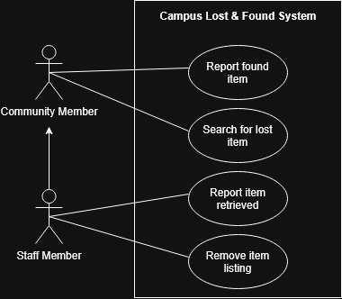
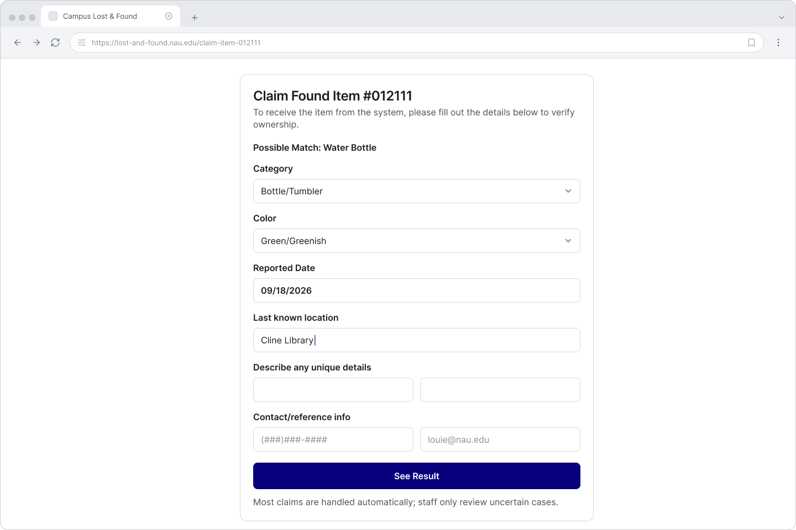
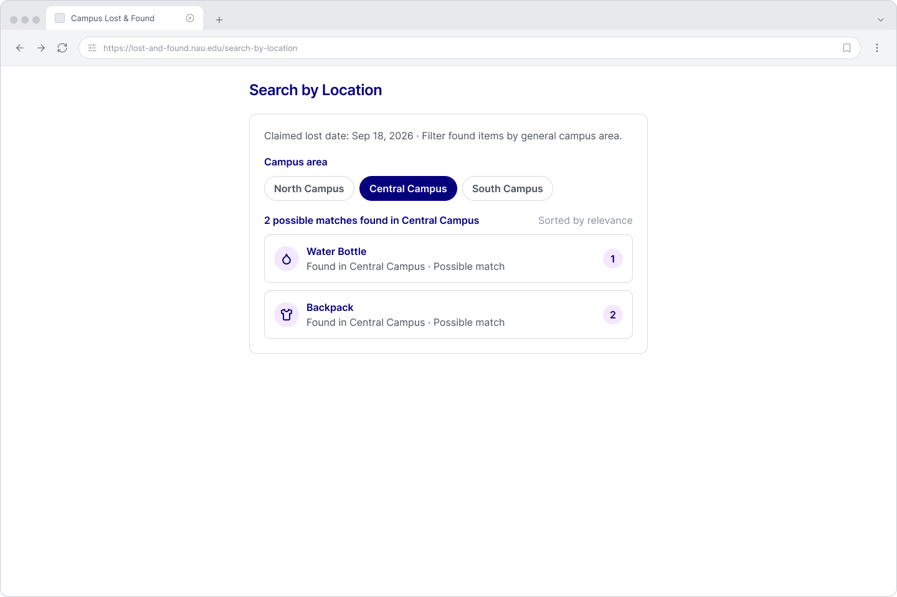
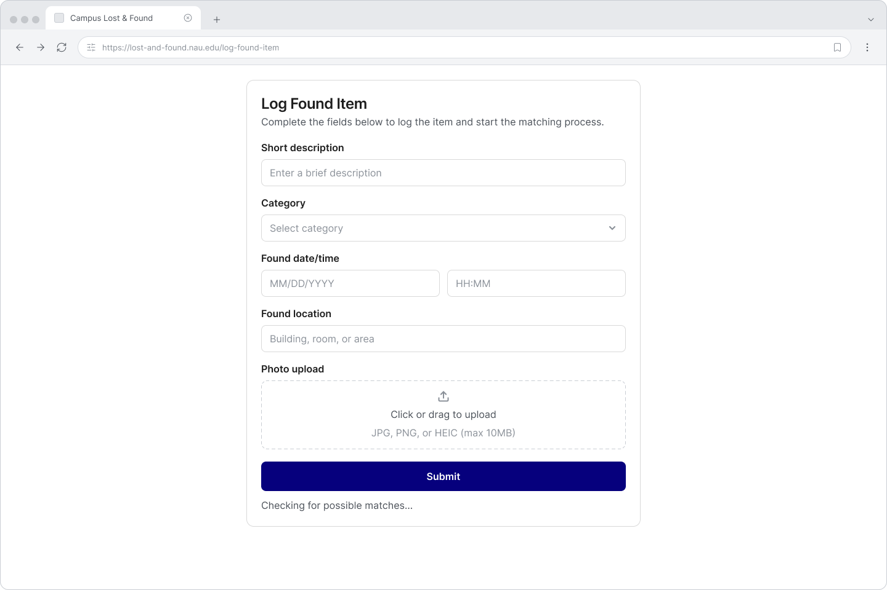
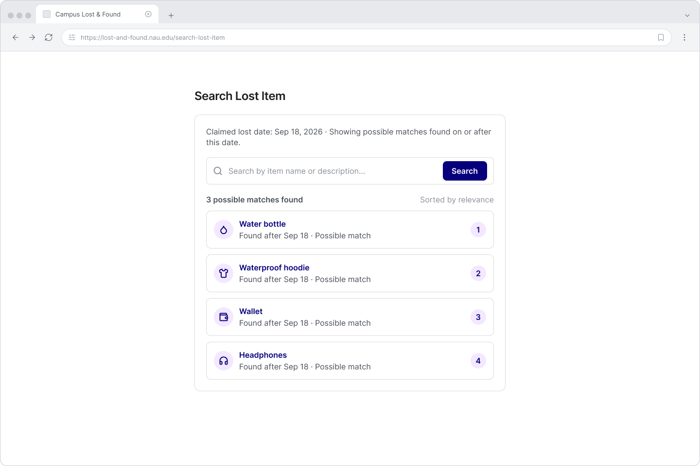
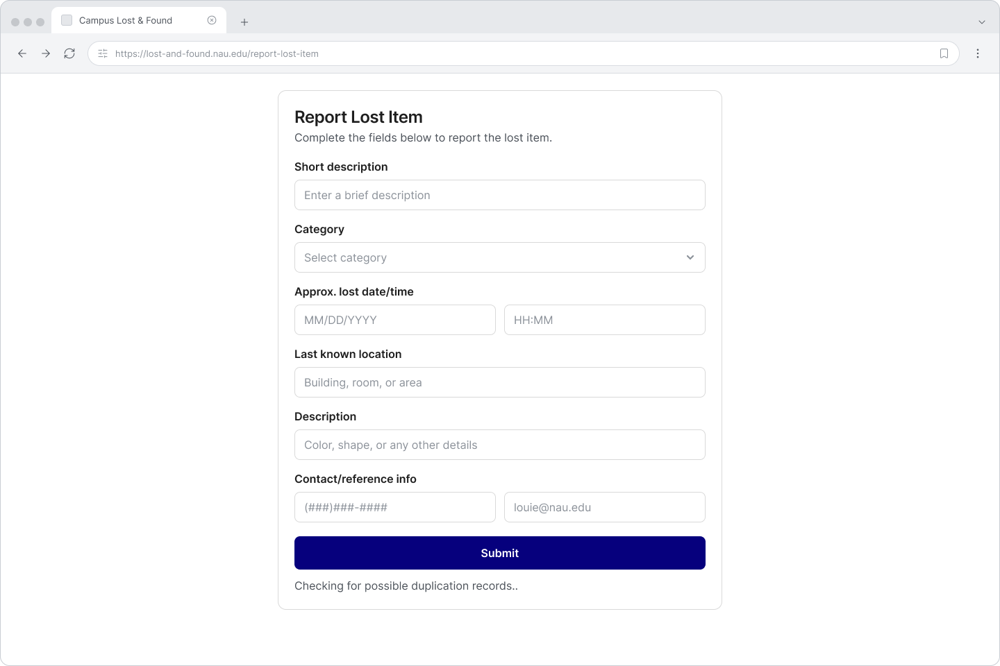
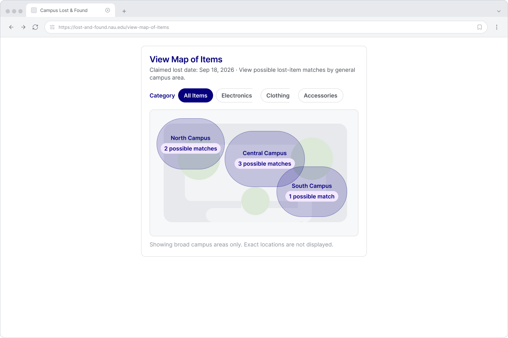

# D.2 Requirements

 

# 1. Positioning

### 1.1 Problem Statement

The problem of an inefficient campus lost and found system affects NAU students and faculty members who lose personal or academic items all over campus, forcing them to waste time physically searching for their lost items or outright giving them up.

### 1.2 Product Position Statement

|                                 |                                                                                                                           |
| ------------------------------- | ------------------------------------------------------------------------------------------------------------------------- |
| **For**                         | NAU students and faculty                                                                                                  |
| **Who**                         | need an organized way to connect lost items with the people who are looking for them                                      |
| **The NAU Lost & Found System** | is a web-based lost and found management app                                                                              |
| **That**                        | allows people all over campus to efficiently search for and report lost belongings                                        |
| **Unlike**                      | a traditional lost and found, which generally requires students to visit multiple locations or contact staff individually |
| **Our product**                 | will provide a standardized system for reporting and searching for lost belongings                                        |

### 1.3 Value Proposition and Customer Segment

Value Proposition: The NAU Lost and Found System helps NAU students and staff recover lost belongings without building-by-building guesswork of typical lost and found desks. Instead of running all over campus, the webapp automatically matches your lost item report against items already turned in and notify you, while the rest of the inventory remains private.

Consumer Segment: NAU students who have lost personal belongings on NAU campus.

 

# 2. Functional Requirements

1. NAU community members must be able to report lost items they discover.
2. Community members must be able to search for items that they lost.
3. Staff members must be able to report items as having been retrieved.
4. Staff members must be able to remove items that are not actually present.

 

# 3. Non-Functional Requirements

1. Usability: The system should be easy for students to use when reporting a lost or found item.
   Measurable acceptance criterion: At least 90% of test users should be able to submit a lost or found item report in 5 minutes or less.

2. Performance Efficiency: The system should return search results quickly when a student searches for a lost item.
   Measurable acceptance criterion: Search results should appear within 10 seconds for at least 95% of searches during testing.

3. Reliability: The system should work correctly during normal use without frequently failing.
   Measurable acceptance criterion: At least 99% of user requests should be completed successfully during a 24-hour period.

4. Security: The system should keep the user's information protected from people who are not allowed to access it.
   Measurable acceptance criterion: A user that is not an admin should not be able to change item descriptions or information.

5. Maintainability: The system should be easy for developers to update or fix without breaking other parts of the system.
   Measurable acceptance criterion: After making a change to one part of the system, at least 95% of the existing program should still pass.

 

# 4. Minimum Viable Product (MVP)

The minimum viable product is a web application that shows missing items and filters out the other items as the user inputs information about the item they have lost. Certain users like front desk workers would be able to input missing items and the information and the application would display the item to the students.

This MVP solves the problem of people wasting time trying to find the item. As the user uses the filters to find their item, the amount of items shown decreases until the user finds what they are missing. Then, they can go straight to the lost and found in a building instead of looking around campus.

 

# 5. Use Cases

## 5.1 Use Case Diagram

## 5.2 Use Case Descriptions and Interface Sketch

### Use Case: Claim Found Item (Jake)

**Actor:** NAU Student

**Trigger:** The student wants to claim an item that was logged in the system.

**Pre-conditions:**

- The student has access to the NAU Lost & Found System.
- The student has lost an item on campus.

**Post-conditions:**

- The student receives the confirmed item.
- The item is marked as claimed in the system.

**Success Scenario:**

1. The student searches for their lost item.
2. The system shows possible matching items.
3. The student identifies a possible match.
4. The system provides information needed to claim the item.
5. The student verifies ownership.
6. The student receives the item.

**Alternate Scenarios:**

**3a. The student misidentifies the item.**

- The system or staff determines that the item does not belong to the student.
- The item remains available for other possible owners.

### Use Case: Search by Location (Amaya)

**Actor:** NAU Student

**Trigger:** The student wants to search for a lost item using an approximate location.

**Pre-conditions:**

- The student has access to the NAU Lost & Found System.
- The student has lost an item on or near campus.

**Post-conditions:**

- The student sees possible matching items based on the selected area.

**Success Scenario:**

1. The student requests to search for a lost item by location.
2. The system requests an approximate area.
3. The student provides the area where the item may have been lost.
4. The system searches for possible matches associated with that area.
5. The system shows matching items.
6. The student reviews the results.

**Alternate Scenarios:**

**4a. No matching items are found in the selected area.**

- The system informs the student that no current matches are available.

**4b. The item was found in one area but transferred to another location.**

- The system keeps the item available as a possible match even if its current holding location is different.

### Use Case: Log Found Item (Brennan)

**Actor:** Campus Staff Member

**Trigger:** A staff member receives or discovers a lost item and wants to register it in the system.

**Pre-conditions:**

- The staff member has access to the system.
- The staff member has the found item or knows where it is being held.

**Post-conditions:**

- The found item is registered in the system.
- The item is available for matching with lost-item reports.

**Success Scenario:**

1. The staff member requests to log a found item.
2. The system requests information about the item.
3. The staff member provides a description.
4. The staff member provides when and where the item was found.
5. The staff member provides available photos.
6. The staff member submits the item information.
7. The system validates the information.
8. The system checks for possible matching lost-item reports.
9. The system notifies relevant users if a possible match is found.
10. The system confirms that the item was successfully logged.

**Alternate Scenarios:**

**7a. A possible duplicate entry is detected.**

- The system flags the entry for staff review.
- The staff member decides whether to keep, merge, or cancel the new entry.

**8a. No existing match is found.**

- The system keeps the item as unclaimed for future matching.
- No match notification is sent.

### Use Case: Search for Lost Item (Lareine)

**Actor:** Campus Community Member

**Trigger:** The user wants to find a lost item.

**Pre-conditions:**

- The user has access to the system.

**Post-conditions:**

- The user sees possible matching items.

**Success Scenario:**

1. The user initiates a search request.
2. The system requests information about the lost item.
3. The user provides the known details.
4. The system searches for possible matches.
5. The system shows matching items.
6. The user reviews the results.

**Alternate Scenarios:**

**3a. Not enough information is provided.**

- The system requests additional details.

**4a. No matching items are found.**

- The system informs the user that no current matches are available.

### Use Case: Report Lost Item (Evelyn)

**Actor:** Front Desk Worker

**Trigger:** The front desk worker wants to report a missing item.

**Pre-conditions:**

- The front desk worker has access to the system.

**Post-conditions:**

- The lost-item report is registered in the system.

**Success Scenario:**

1. The front desk worker requests to report a lost item.
2. The system requests information about the item.
3. The front desk worker provides the available information.
4. The system validates the information.
5. The system registers the lost-item report.
6. The system confirms that the report was created.

**Alternate Scenarios:**

**3a. Not enough information is provided.**

- The system requests additional details.

**4a. The item is already recorded in the system.**

- The system informs the front desk worker that a possible duplicate exists.

### Use Case: View Map of Items (Rose)

**Actor:** Campus Community Member

**Trigger:** The user wants to search for a lost item based on an area of campus.

**Pre-conditions:**

- The user has access to the system.
- The item was lost on or near campus.

**Post-conditions:**

- The user sees possible matching items represented by campus area.

**Success Scenario:**

1. The user requests to search for a lost item on the map.
2. The system requests available item information.
3. The user provides a description and an approximate campus area.
4. The system searches for possible matches.
5. The system shows matching items associated with the relevant area.
6. The user reviews the results.

**Alternate Scenarios:**

**4a. No items match the provided description.**

- The system informs the user that no current matches are available.

**4b. No matching items are associated with the selected area.**

- The system informs the user that no matches were found in that area.

# 6. User Stories

(Write two user stories per group member. The stories may relate to the use cases or to other features. Use the following format: "As a <ROLE>, I want <SOMETHING> so that <GOAL>.")

### User Story 1

**As a campus community member, I want to search for lost items in one centralized place so that I can avoid going to the wrong location.**

**Priority:** Must have  
**Estimated effort:** 3 hours

### User Story 2

**As a campus community member, I want to report a lost item online so that I can ask for help without contacting office staff directly.**

**Priority:** Should have  
**Estimated effort:** 4 hour

### User Story 3

**As a front desk worker, I want to report a lost item so that the lost and found bin can be cleared sooner.**

**Priority:** Should have
**Estimated effort:** 3 hours

### User Story 4

**As a NAU student, I want to look through the items so that I can find my item even if I don't know where I last had it.**

**Priority:** Must Have
**Estimated effort:** 4 hours

### User Story 5

**As someone that is all over campus regularly, I want to be able to sort lost items by the area that they were found in so that I can narrow my search.**

**Priority:** Should have
**Estimated effort:** 2 hours

### User Story 6

**As an NAU faculty member, I want to be able to add and manage information about found belongings so that students can search for their lost items more efficiently.**

**Priority:** Should Have
**Estimated effort:** 10 hours

### User Story 7

**As a campus staff member, I want to log a found item in only a few minutes, so that I can quickly return to my normal duties.**

**Priority:** Must Have
**Estimated effort:** 12-15 hours

### User Story 8

**As a campus staff member, I want the system to automatically compare items and notify whoever lost them, so that I don't have to manually track down or contact students myself.**

**Priority:** Must Have
**Estimated effort:** 15-20 hours

### User Story 9

**As a campus community member, I want to update or remove a lost item report, so that the information stays accurate if I find my item.**

**Priority:** Should Have
**Estimated effort:**  3-5 hours

### User Story 10

**As a student who is trying to find my lost item, I want to include details about when and where I lost my item, so that the system can find better matches.**

**Priority:** Should Have
**Estimated effort:** 5-7 hours

### User Story 11

**As someone who found a lost item on campus, I want to see the location of lost-and-found bins, so that I know where to take what I found.**

**Priority:** Must Have
**Estimated effort:** 6-12 hours

### User Story 12

**As someone who has lost something on campus, I want to see items like the one I lost on a map, so that I know which way I need to go.**

**Priority:** Should Have
**Estimated effort:** 18-24 hours

# 7. Issue Tracker

Register each user story in your issue tracker, using the full story as the issue title. Add a screenshot of the issue tracker in the deliverable. Throughout the development, we expect that you use the issue tracker to track the progress of your work.

# 8. Member Participation

- Brennan Smith (@bs2863) – 17%: User stories, use case, UML diagram, and review.
- Lareine Han (@awesomeyeti) – 17%: User stories, use case, interface sketches, and document consistency.
- Jake Domabyl (@jpd254) – 17%: User stories, use case, and review.
- Amaya Gillison (@amayajg) – 17%: User stories, use case, non-functional requirements, and review.
- Evelyn Torres (@evetor419) – 16%: User stories, use case, and review.
- Rose Hankins (@az-raven) – 16%: User stories, use case, functional requirements, and review.
